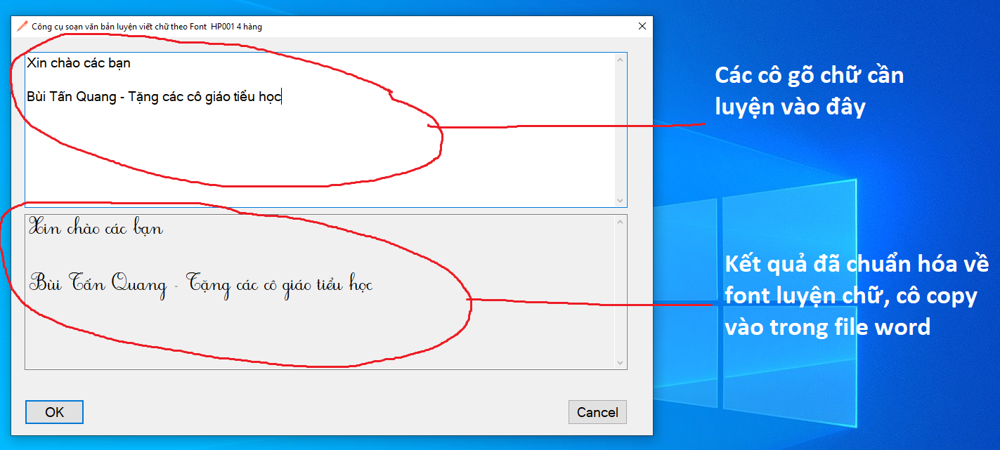

## Bộ công cụ tạo ra các file luyện viết chữ Tiếng Việt theo chuẩn của Bộ Giáo dục

Lời dẫn
------------
Việc tạo ra file luyện chữ Tiếng Việt cho học sinh tiểu học theo chuẩn của Bộ Giáo dục khá phức tạp. Công cụ này sẽ giúp các thầy cô rút ngắn thời gian trong việc tạo ra các file luyện viết chữ

Sử dụng
------------
