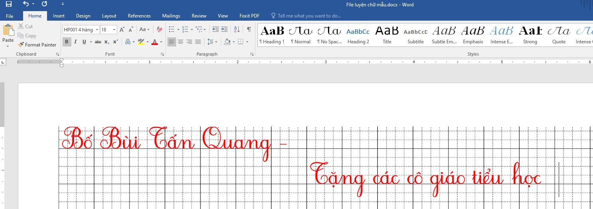

# Bộ công cụ tạo ra các file luyện viết chữ Tiếng Việt theo chuẩn của Bộ Giáo dục

Link tải
------------
https://github.com/langmaninternet/LuyenChuTieuHoc/archive/1.2.zip

Lời dẫn
------------
Việc tạo ra file luyện chữ Tiếng Việt cho học sinh tiểu học theo chuẩn của Bộ Giáo dục khá phức tạp. Các âm nối "ôi" "ơi" "ơu" ... phải chỉnh lại tỉ mỉ từng chỗ một, rất cầu kì và chi tiết. Công cụ này sẽ giúp các thầy cô rút ngắn thời gian trong việc tạo ra các file luyện viết chữ. Chỉ việc viết chữ 1 cách bình thường và công cụ sẽ output ra chữ theo chuẩn để luyện viết

Bước 1 : Hướng dẫn cài font đối với máy chưa cài font "HP001 4 hang" .
------------
Đối với những máy tính mở file word ra thấy lằng nhằng không nhìn được gì có nghĩa là máy tính này chưa được cài bộ font "HP001 4 hang" .
Các thầy cô copy toàn bộ font trong thư mục "Font luyện chữ tiểu học theo quy chuẩn của bộ giáo dục" vào trong đường dẫn "C:\Windows\Fonts" là được

Bước 2 : Hướng dẫn tạo ra text chuẩn 
------------
Bật công cụ LuyenChuTieuHoc và copy hoặc gõ text vào khung bên trên . Khung bên dưới sẽ hiện chữ để copy vào file text

Bước 3 : Hướng dẫn copy vào file word mẫu "File luyện chữ mẫu.docx"
------------
Sau khi có text chuẩn, các cô mở  "File luyện chữ mẫu.docx" cho text vào là thành công

Nguyên tắc của file word luyện viết là ở trong file word có 2 phần:
+ Phần nền : là các ô vuông được kẻ bằng 1 ký tự trong bộ font, cái này nằm trong 1 Shape, và đã được Send to back. Nếu cần thì mình có thể căn chỉnh tọa độ theo ý muốn
+ Phần chữ : Các cô copy chữ chuẩn từ tool vào là được

Góp ý 
------------
Mọi góp ý xin gửi về : langmaninternet@gmail.com hoặc phản ánh trực tiếp qua facebook : https://www.facebook.com/langmaninternet

